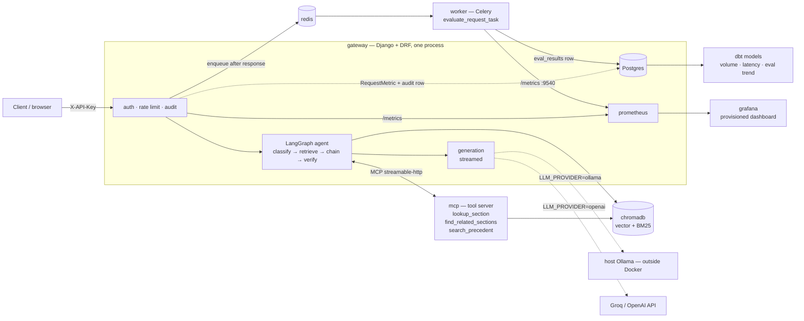

# Naija Civic Guard

**Grounded question-answering over the Constitution of the Federal Republic of
Nigeria (1999), built as a running platform rather than a notebook.**

Ask a question in plain English — *"What does Section 45 say about restrictions
on fundamental rights?"* — and get an answer drawn **only** from the
constitutional text, with the specific sections it came from, streamed
token-by-token. Underneath that answer is a full operational stack: an agentic
retrieval pipeline, a Model Context Protocol (MCP) tool server, an API gateway
with authentication / rate limiting / audit logging, per-request metrics in
Postgres and Prometheus, asynchronous quality evaluation on its own worker,
Grafana dashboards, and dbt models over the logs — all standing up from a
single `docker compose up`.

> ⚖️ **It is an educational tool.** Retrieval precision is not at a production
> bar for legal use (see [Limitations](#limitations)). Treat every answer as a
> pointer to sections worth reading, not as legal advice.

---

## Contents

- [Why this exists](#why-this-exists)
- [The system at a glance](#the-system-at-a-glance)
- [How a request flows](#how-a-request-flows)
- [The build, layer by layer](#the-build-layer-by-layer)
  - [1. Ingestion & the vector store](#1-ingestion--the-vector-store)
  - [2. Hybrid retrieval](#2-hybrid-retrieval)
  - [3. The retrieval agent (LangGraph)](#3-the-retrieval-agent-langgraph)
  - [4. The MCP tool server](#4-the-mcp-tool-server)
  - [5. Generation & the provider switch](#5-generation--the-provider-switch)
  - [6. The API gateway](#6-the-api-gateway)
  - [7. Request correlation](#7-request-correlation)
  - [8. Observability — two layers](#8-observability--two-layers)
  - [9. Asynchronous evaluation](#9-asynchronous-evaluation)
  - [10. Analytics (dbt)](#10-analytics-dbt)
  - [11. Containerisation](#11-containerisation)
- [Tech stack](#tech-stack)
- [Getting started](#getting-started)
- [Using it](#using-it)
- [Observing it](#observing-it)
- [Testing](#testing)
- [Performance (measured)](#performance-measured)
- [Project layout](#project-layout)
- [Limitations](#limitations)
- [Roadmap](#roadmap)

---

## Why this exists

A generic LLM will answer questions about Nigerian law from a blurry mixture of
training data, other jurisdictions, and confident guessing. For a legal document
you want the opposite: answers **anchored to the source**, with citations, that
say *"I don't know"* when the text doesn't cover it.

Retrieval-Augmented Generation gets you there — retrieve the relevant passages,
put them in the prompt, instruct the model to use only those. But a `SELECT …
ORDER BY embedding <-> query LIMIT 5` in a script is not a system. Turning it
into something a team could actually operate means answering: *Who's calling
it? How fast is it, broken down by stage? Is retrieval any good, and how would
we know without blocking the user? What happens when a dependency is down? How
do we run the whole thing reproducibly?*

This repo is that second 90%.

---

## The system at a glance



| Service | Role |
|---|---|
| **gateway** | Django + DRF. `X-API-Key` auth (`ApiKey` model), per-key rate limit (DRF throttle), audit-log middleware, the LangGraph retrieval agent, streaming NDJSON responses, one `RequestMetric` row per request, `/metrics`. Runs 1 gunicorn worker + threads (keeps the Prometheus registry consistent). |
| **mcp** | Standalone MCP server (official `mcp` SDK, streamable-HTTP). Three tools the agent's *retrieve* and *chain* nodes call: `lookup_section`, `find_related_sections`, `search_precedent` (stub). Reads ChromaDB directly — no torch, starts fast. |
| **chromadb** | Vector store. Populated on first boot from the constitution PDF (`AUTO_INGEST=1`). |
| **postgres** | `request_audit_log` + `rag_request_metrics` + `eval_results`. One database; the three tables join on `request_id`. |
| **redis** | Celery broker for the async evaluator. |
| **worker** | Celery worker (`--pool=threads`) running `evaluate_request_task` — scores retrieval quality *after* the response is sent. Exposes its own `/metrics` on `:9540`. |
| **prometheus** | Scrapes `gateway:8000/metrics` and `worker:9540/metrics`. |
| **grafana** | Datasource + dashboard **provisioned from files** on startup — latency by stage, tokens/sec by provider, MCP tool-call breakdown, eval coverage, async-eval health. |
| **dbt** *(opt-in, `--profile analytics`)* | `dbt-postgres` models over the two operational tables. |

Everything **not** in Docker: **Ollama** (wants direct GPU access on the host)
and any **hosted LLM API** (Groq / OpenAI). Containers reach the host's Ollama
via `host.docker.internal`.

---

## How a request flows

```
POST /api/chat/  {query}   + X-API-Key: ncg_…
  │
  ├─ PrometheusBeforeMiddleware        (django-prometheus auto metrics)
  ├─ AuditLogMiddleware                (wraps everything below)
  │
  ├─ DRF:  ApiKeyAuthentication  → 401 if missing/unknown/inactive
  │        IsAuthenticated
  │        ApiKeyRateThrottle    → 429 if over the key's limit
  │
  ├─ ChatView.post
  │     RequestMetrics(request_id = uuid4)          ← the correlation id is born
  │
  │     LangGraph agent, streamed node-by-node:
  │       classify   cheap LLM → direct_lookup | cross_reference | interpretive
  │       retrieve   direct_lookup + a section no. → MCP lookup_section
  │                  interpretive → MCP search_precedent (stub)
  │                  else → hybrid retrieval (Chroma vector + BM25)
  │       chain      retrieved text references another section? → MCP find_related_sections
  │       verify     heuristic: is the retrieved text substantive? if not → reformulate, retry ONCE
  │
  │     generation:  llm.stream(prompt over retrieved context)   → NDJSON tokens to the client
  │
  │  finally (response already sent):
  │     metrics.persist()               → INSERT rag_request_metrics  (Postgres, synchronous)
  │     record_request_metrics(metrics) → Prometheus counters/histograms  (same numbers, not recomputed)
  │     enqueue evaluate_request_task   → Redis  (fire-and-forget, on a bounded thread pool)
  │
  └─ AuditLogMiddleware → INSERT request_audit_log  (api_key, endpoint, status, request_id)

… seconds later, off the user's critical path …
worker: evaluate_request_task → score (keyword coverage; hit / MRR if in the eval set)
                              → INSERT eval_results  (Postgres, joins on request_id)
                              → Prometheus (worker's own registry, :9540)
```

The browser chat page streams the agent's steps live — one line per node as it
finishes — above the answer.

---

## The build, layer by layer

### 1. Ingestion & the vector store

`ingest.py`: `PyPDFLoader` reads `constitution-of-the-federal-republic-of-nigeria.pdf`
→ a regex tags each passage with its `Section N` → `RecursiveCharacterTextSplitter`
(`chunk_size=800`, `overlap=150`, splitting on `\nSection `, `\nPART `, then
paragraphs) → embed with `sentence-transformers/all-MiniLM-L6-v2` (384-dim, CPU,
~90 MB) → store in ChromaDB.

- **Chunk size** trades vector precision (small) against context coherence
  (large); overlap buys continuity at the cost of duplication.
- **Section tagging is coarse** — roughly one section per PDF page — and is the
  single biggest quality limitation.
- `rag_engine/chroma.py` is a client factory: a local `PersistentClient` when
  `CHROMA_HOST` is unset, a networked `HttpClient` in compose. Ingest and query
  **must** use the same embedding model, so both go through this factory.
- First `docker compose up` runs `manage.py ingest --if-empty` from the gateway
  entrypoint, so the stack bootstraps its own index.

### 2. Hybrid retrieval

Vector search understands *meaning* ("fair hearing" ≈ "due process"); BM25
(lexical) nails *exact tokens* ("Section 45", defined terms, names). We run
both and fuse the results (`EnsembleRetriever`, weighted toward keyword because
"Section N" queries dominate). BM25 isn't persisted, so `RagService.__init__`
pulls every chunk from Chroma once at boot and builds the in-memory index
(~100 ms for 700 chunks).

### 3. The retrieval agent (LangGraph)

Retrieval is a small **state machine**, not one call:

```
classify ─► retrieve ─► chain ─► verify ─(inadequate & retry_count<1)─► retrieve
                                    └─(else)──► generate
```

| node | what | why separate |
|---|---|---|
| **classify** | one **cheap** LLM call (`CLASSIFY_LLM_MODEL`, *not* the generation model) → `direct_lookup` / `cross_reference` / `interpretive`; keyword heuristic fallback | downstream behaviour differs per type; the choice is observable and swappable |
| **retrieve** | `direct_lookup` + a section number → MCP `lookup_section` (skip semantic search); `interpretive` → also MCP `search_precedent`; else hybrid retrieval | the right retrieval *method* depends on the question shape |
| **chain** | scan retrieved text for references to *other* sections → MCP `find_related_sections` to pull them in (cap 2) | legal answers routinely say "subject to section 45" — the first hit is incomplete alone |
| **verify** | cheap deterministic check: enough distinct sections / characters / the asked section present? if not, reformulate and retry **once** (hard cap) | catch thin retrieval before wasting a generation call |

**Trade-off:** you gain targeted lookups, cross-reference following, a
self-correction loop, and a legible trace (surfaced in the UI and in
`rag_request_metrics`). You pay +1 LLM call (classify) per request and up to 2×
retrieval on a retry — measured at ~250–600 ms classify, ~40–90 ms
retrieve+chain, negligible next to generation. Agent loops are **always**
capped; an unbounded self-correcting agent is a cost incident waiting to happen.

`query_stream` drives the graph with `graph.stream()` and emits a
`{"type":"agent","node":…}` NDJSON line as each node finishes — that's what the
browser renders live.

### 4. The MCP tool server

The retrieval primitives are extracted into a **standalone MCP server**
(`rag_engine/mcp_server.py`, `FastMCP`) exposing three tools:

| tool | what |
|---|---|
| `lookup_section(number)` | direct ChromaDB metadata fetch of a section's chunks — **bypasses ranking entirely** |
| `find_related_sections(section_id)` | regex the section's own text for cross-refs, return those sections' text |
| `search_precedent(query)` | **stub** → *"not yet implemented — case law integration planned"* (a message, not an error) |

`rag_engine/mcp_client.py` holds **one** connection for the process lifetime —
stdio subprocess locally, streamable-HTTP to the `mcp` container in compose. A
fresh connection per call costs ~300–500 ms (ChromaDB client init); reused, warm
calls are ~10–30 ms. The SDK is async-only and LangGraph nodes are sync, so the
session runs on a dedicated event-loop thread. If the server is unreachable the
agent falls back to an in-process path and the request still answers.

**Why bother:** independent testability, reusability, a clean seam to add a real
`search_precedent`, and a process boundary you can scale/deploy separately —
against a network hop per call and a fallback path to maintain.

### 5. Generation & the provider switch

`LLM_PROVIDER` selects the generation model behind one interface:

- `openai` → `ChatOpenAI` against any OpenAI-compatible endpoint (default: Groq
  with `GROQ_API_KEY`; set `OPENAI_BASE_URL` for real OpenAI)
- `ollama` → `ChatOllama` against the host's Ollama

The answer is **streamed** as newline-delimited JSON (`metadata` line, then
`token` lines, then a `done` line with the full timing/agent/tool-call
breakdown). A streaming response holds its server worker for the whole
generation, so the gateway runs **1 gunicorn worker + 8 threads** — the work is
I/O-bound (waiting on the LLM) so threads parallelise fine, and one process
keeps `/metrics` consistent. Exact output-token counts come off the final
stream chunk; a whitespace estimate (flagged) is the fallback.

Everything except this node is provider-independent — see
[Performance](#performance-measured).

### 6. The API gateway

DRF, three concerns:

- **Auth** — `ApiKeyAuthentication` (custom `BaseAuthentication`) checks
  `X-API-Key` against an `ApiKey` row (`key`, `owner`, `is_active`,
  `requests_per_minute`, `created_at`) and returns a lightweight principal.
  Missing / unknown / inactive → **401** (we define `authenticate_header()` so
  DRF returns 401, not 403). Keys are created via `manage.py create_api_key` or
  the admin — never hand-edited.
- **Rate limit** — `ApiKeyRateThrottle` (DRF `SimpleRateThrottle`, sliding-log)
  keyed on the API key, not a Django user. `API_KEY_DEFAULT_RATE` default; an
  `ApiKey.requests_per_minute` overrides per key. Over the limit → **429**.
  *(Backing store is LocMemCache — exact for one worker; use a shared cache to
  scale out.)*
- **Audit** — `AuditLogMiddleware` is **plain Django middleware**, positioned
  last so it wraps the view and records the 401s and 429s too. One
  `request_audit_log` row per `/api/` request.

### 7. Request correlation

A `uuid4` `request_id` is minted at the top of `ChatView`, returned on the
`X-Request-ID` header, and threaded through everything: `rag_request_metrics`,
`request_audit_log`, the enqueued eval task, `eval_results`. One `LEFT JOIN`
reassembles the full picture across two processes and three tables — lightweight
distributed tracing without adopting OpenTelemetry.

```sql
SELECT a.status_code, m.provider, m.total_time_ms, m.classify_label,
       e.matched_ground_truth, e.keyword_coverage
FROM request_audit_log a
JOIN rag_request_metrics m ON m.request_id = a.request_id
LEFT JOIN eval_results   e ON e.request_id = a.request_id
WHERE a.request_id = '…';
```

### 8. Observability — two layers

Different questions need different stores, and the numbers are computed **once**.

| | Postgres (`rag_request_metrics`) | Prometheus |
|---|---|---|
| answers | "show me *that* slow request yesterday with its full agent trace and query text" | "p95 generation latency by provider over the last hour, alert if it doubles" |
| shape | high-cardinality rows, joinable, SQL | pre-aggregated time-series, cheap to keep, labels are low-cardinality |

One `RequestMetrics` dataclass is filled through the request (per-node latency
via `perf_counter`, token count, provider, tool calls, error). In the `finally`
block it both `INSERT`s the Postgres row **and** feeds
`record_request_metrics()` which observes the histograms / increments the
counters. Custom series: `request_latency_seconds{stage}`,
`generation_tokens_per_second{provider}`, `mcp_tool_calls_total{tool_name}`,
`agent_retries_total`, `llm_provider_requests_total{provider}`, plus the
worker-side `eval_keyword_coverage`, `celery_eval_task_duration_seconds`,
`celery_queue_depth`, `celery_eval_task_failures_total`.

`django-prometheus` provides `/metrics` and the automatic request/response
series. The Celery worker is a separate process, so it runs its **own**
`prometheus_client` HTTP server on `:9540` (with `--pool=threads` so the
registry is shared across task threads) and Prometheus scrapes it as a second
target.

### 9. Asynchronous evaluation

Scoring an answer's retrieval quality is worth doing but not something the user
should wait for. After the response is streamed and the metrics row written,
`_enqueue_eval()` submits `evaluate_request_task` to Redis **on a bounded thread
pool** — the request thread never does broker I/O, so a slow or dead Redis
cannot affect response latency (verified: stop Redis mid-run, latency
unchanged, the eval row just never appears).

The Celery worker runs `evaluate_retrieval()` — the *same* scoring code the
offline `retrieval_eval.py` uses — and writes an `eval_results` row keyed by
`request_id`:

| metric | definition | proxies |
|---|---|---|
| hit rate | was the target section retrieved? | recall@k |
| MRR | `1 / rank` of the target section | ranking quality |
| keyword coverage | fraction of expected legal terms in the retrieved text | precision-ish; still computed for off-set queries (keywords from the query) |

**Design rule:** the gateway owns `rag_request_metrics`, the worker owns
`eval_results` — two tables joined on `request_id`, never one row updated by two
processes. "No eval row yet" is a natural, correct state; `celery_queue_depth`
climbing tells you eval is falling behind generation (doesn't hurt users, does
mean the data is going stale). Celery + Redis with `acks_late` is
at-least-once, so a re-run just writes another row (add a unique constraint on
`request_id` if that matters to you).

### 10. Analytics (dbt)

`dbt/` (dbt-postgres) reads the two operational tables as `sources` and builds
three views in schema `analytics`:

| model | grain | answers |
|---|---|---|
| `daily_query_volume` | day | traffic, errors, retries, how many were evaluated |
| `avg_latency_by_provider_and_stage` | provider × stage | avg / p50 / p95 per pipeline stage — feeds the table below |
| `eval_score_trend` | day × provider | hit rate / MRR / keyword coverage over time |

Prometheus is for operational time-series and alerting; dbt is for analytical
questions over the full history with joins and arbitrary SQL, kept declarative
and tested (`dbt build` runs `not_null` / `unique` / `accepted_values`).
`avg_latency_by_provider_and_stage` unpivots the per-stage columns
(`classify_ms`, `retrieve_ms`, …) into `(stage, latency_ms)` rows.

Run: `docker compose --profile analytics run --rm dbt build` (opt-in, not part
of `up`).

### 11. Containerisation

Eight services, each with a healthcheck and explicit dependency ordering
(`condition: service_healthy`, not just `service_started`). Prometheus config
and the Grafana datasource + dashboard are **provisioned from files**, not
clicked together.

**Every value in `docker-compose.yml` comes from `.env`** — no inline defaults.
A missing required var aborts `docker compose up` with a message
(`required variable POSTGRES_IMAGE is missing a value: set POSTGRES_IMAGE in .env`).
`.env.example` is the authoritative list, grouped by concern, with the
compose-network values as given and a note on the four lines to blank for a
bare (non-Docker) run.

Things that bit us and how they're handled, so they don't bite you:

- **Image size.** The Linux `torch` wheel pulls ~2.5 GB of CUDA libraries by
  default. `docker/gateway.Dockerfile` installs `torch==…+cpu` from the PyTorch
  CPU index *first* → 812 MB image, ~4 min build.
- **Pin the framework.** Unpinned `Django` resolved to a version that removed a
  symbol DRF imports → `ImportError` in the container, fine locally. Pinned
  `Django==6.0.5`.
- **Layer caching.** `COPY requirements.txt` + `pip install` is its own layer
  before `COPY . .`, so code changes rebuild in seconds.
- **Networking.** Incremental `up <service>` after a partial failure can leave a
  container with no network (broken DNS). Do a clean `down` + one `up`.
  `extra_hosts: host-gateway` interfered with Docker Desktop's embedded DNS and
  was removed — `host.docker.internal` is native there.
- **Ports.** Some Windows port ranges are reserved; Postgres isn't published —
  use `docker compose exec postgres psql`.

---

## Tech stack

| Layer | Choice |
|---|---|
| Web / API | Django 6.0, Django REST Framework, gunicorn, WhiteNoise |
| Retrieval agent | LangGraph; LangChain (`langchain-core`, `-chroma`, `-huggingface`, `-openai`, `-ollama`, `-groq`) |
| Tools | official `mcp` SDK (`FastMCP`), streamable-HTTP / stdio |
| Embeddings | `sentence-transformers/all-MiniLM-L6-v2` (local, CPU) |
| Vector store | ChromaDB (`chromadb/chroma`), HTTP or local persist |
| Generation | Groq / OpenAI-compatible (`ChatOpenAI`) or host Ollama (`ChatOllama`) |
| Data | Postgres 16 (compose) / SQLite (local & tests) |
| Async | Celery 5 + Redis 7 |
| Metrics | `django-prometheus` + `prometheus_client`, Prometheus, Grafana |
| Analytics | dbt (`dbt-postgres`) |
| Orchestration | Docker Compose (8 services) |

---

## Getting started

### With Docker (the whole platform)

```bash
git clone https://github.com/ogonkem/naija-civic-guard_AI_Platform.git
cd naija-civic-guard_AI_Platform

cp .env.example .env
#   fill in at least:
#     GROQ_API_KEY=...          (the "openai" provider path — OpenAI-compatible)
#     DJANGO_SECRET_KEY=...     python -c "from django.core.management.utils import get_random_secret_key as g; print(g())"
#   the rest already has working docker-compose-network values

docker compose up --build
```

First boot (a few minutes) downloads the embedding model, migrates Postgres,
ingests the PDF into ChromaDB, then serves. When you see
`RAG service warmed up on boot.` it's ready.

```bash
# mint an API key
docker compose exec gateway python manage.py create_api_key --owner "me"

# ask something
curl -N -X POST localhost:8000/api/chat/ \
  -H "X-API-Key: <key>" -H "Content-Type: application/json" \
  -d '{"query":"What does Section 45 say about restrictions on fundamental rights?"}'
```

| | URL |
|---|---|
| Browser chat (agent trace live) | <http://localhost:8000/> |
| Grafana dashboard (anon, pre-loaded) | <http://localhost:3000/d/civic-guard> |
| Prometheus | <http://localhost:9090> |
| Gateway / worker metrics | <http://localhost:8000/metrics> · <http://localhost:9540/metrics> |

Switch the generation model: `LLM_PROVIDER=ollama docker compose up -d gateway`
(needs `ollama pull llama3.2` on the host). Build the analytics models:
`docker compose --profile analytics run --rm dbt build`. Tear down:
`docker compose down` (`-v` also wipes the Postgres / Chroma volumes).

### Without Docker (just the app)

```bash
python -m venv .venv && . .venv/Scripts/activate   # or bin/activate
pip install -r requirements.txt
# in .env: blank POSTGRES_HOST (→ SQLite), CHROMA_HOST (→ local dir),
#          MCP_SERVER_URL (→ stdio subprocess); point REDIS_URL/OLLAMA_BASE_URL at localhost
python ingest.py
python manage.py migrate
python manage.py create_api_key --owner me
python manage.py runserver
```

---

## Using it

**API** — `POST /api/chat/` with `{"query": "..."}` and `X-API-Key`. Returns a
streamed `application/x-ndjson` body: `agent` lines (one per graph node),
a `metadata` line (sources), `token` lines, a `done` line with
`timings_ms` / `agent` / `mcp_tool_calls`. No key → 401; over the rate limit → 429.

**Browser** — <http://localhost:8000/> provisions its own key and shows the
agent working, one line per node, above the streamed answer:

```
classify → cross_reference · 623 ms
retrieve · 1 call(s) · 36 ms   ↳ Section 4, Section 17, Section 185
chain · 33 ms · find_related_sections 18ms · no new cross-refs
verify · 0.4 ms · ⚠ inadequate → retrying once
retrieve · 4 call(s) · 66 ms   ↳ Section 4, Section 20, Section 128
…
```

**Management commands**

```bash
python manage.py create_api_key --owner "acme" [--rpm 120] [--list]
python manage.py ingest [--if-empty]
python manage.py dump_metrics [-n N] [--errors] [--csv]     # per-request latency + agent trace
python manage.py dump_eval    [-n N] [--pending]            # requests joined to their eval results
```

---

## Observing it

- **`/metrics`** on the gateway (`:8000`) and worker (`:9540`) — custom series
  plus django-prometheus automatics.
- **Grafana** `civic-guard` dashboard — latency by stage, tokens/sec by
  provider, MCP tool-call breakdown, eval coverage, and a separate async-eval
  health row (queue depth, task duration p50/p90/p99, failures).
- **Postgres** — `rag_request_metrics` (sync, per request, full agent trace),
  `eval_results` (async, from the worker), `request_audit_log` (every `/api/`
  hit incl. 401/429). Join on `request_id`.
- **dbt** — `analytics.daily_query_volume`, `analytics.avg_latency_by_provider_and_stage`,
  `analytics.eval_score_trend`.

---

## Testing

```bash
python manage.py test rag_engine        # 28 unit + integration tests (SQLite, no external services)
python retrieval_eval.py                # offline retrieval quality → eval_report.md
```

**[TESTING.md](TESTING.md)** — a 15-step manual walkthrough of the running
stack: health-check all 8 services, auth (401), a streamed query, **the
retrieval agent's per-query decisions** (each classify label, chaining, the
verify retry), **the MCP tool server** (list + call each tool, and the agent's
fallback when it's stopped), the synchronous metrics row, the async eval row,
the audit-log join, rate limiting (429), Prometheus targets, the Grafana
dashboard, the `LLM_PROVIDER` split, the browser trace, dbt.

---

## Performance (measured)

Real numbers from this deployment's own `rag_request_metrics` — 16 requests
through the containerised stack (10 `openai`, 6 `ollama`), read via the dbt
models. **There is no "modal" provider in this project** — the two generation
paths are `openai` (Groq's OpenAI-compatible API, `openai/gpt-oss-20b`) and
`ollama` (host Ollama, `llama3.2`, CPU).

| stage | openai — avg / p95 | ollama — avg / p95 |
|---|---:|---:|
| classify (cheap LLM) | 361 / 575 ms | 565 / 677 ms |
| retrieval (MCP `lookup_section` + hybrid) | 41 / 58 ms | 41 / 57 ms |
| chain (MCP `find_related_sections`) | 39 / 56 ms | 37 / 57 ms |
| verify (heuristic) | 0.1 ms | 0.1 ms |
| **generation** | **1160 / 1406 ms** | **22164 / 64677 ms** |
| **total** | **1607 / 1926 ms** | **19869 / 62232 ms** |

- **Throughput:** `openai` ≈ **349 tok/s** avg; `ollama` ≈ **8 tok/s** (its
  first call also paid a ~78 s cold model load, which pulls the p95 up).
- **Retrieval quality** is provider-independent, as expected — `openai`
  hit-rate 0.71 / MRR 0.64 / coverage 0.69; `ollama` 0.75 / 0.63 / 0.73.
- **Async eval** adds ~26 ms of worker time per request
  (`celery_eval_task_duration_seconds`) and lands in Postgres a few seconds
  *after* the response — visible in Grafana as the eval-coverage panel updating
  a step behind the latency panels.

**Takeaway:** everything except generation is identical across providers
(~41 ms retrieval either way). The provider choice is purely a
latency/throughput/cost vs privacy/control trade on one node.

---

## Project layout

```
rag_engine/
  views.py            gateway: ChatView (auth/throttle/stream), chat_page, _enqueue_eval
  graph.py            LangGraph: classify/retrieve/chain/verify, streamed
  services.py         RagService: LLM selection, hybrid retriever, generation
  mcp_server.py       standalone MCP tool server (lookup/related/precedent)
  mcp_client.py       persistent MCP client (stdio | streamable-http)
  chroma.py           ChromaDB client factory (local | networked)
  sections.py         shared section-number regex (ingest + chain node)
  metrics.py          RequestMetrics dataclass + persist()
  metrics_prom.py     custom Prometheus series, fed from RequestMetrics
  celery_metrics.py   worker's own /metrics server + queue-depth poller
  tasks.py            evaluate_request_task (Celery)
  eval_core.py        scoring helpers (shared with retrieval_eval.py)
  authentication.py   ApiKeyAuthentication
  throttling.py       ApiKeyRateThrottle
  middleware.py       AuditLogMiddleware
  models.py           ApiKey, RequestAuditLog, RequestMetric, EvalResult
  management/commands/ create_api_key, ingest, dump_metrics, dump_eval

civic_guard/          Django project: settings, urls (/metrics), celery.py
ingest.py             PDF → chunk → tag → ChromaDB
retrieval_eval.py     offline eval → eval_report.md
evaluation_set.jsonl  ground-truth queries {query, target, keywords}
dbt/                  dbt-postgres analytics models
docker/               gateway/mcp/dbt Dockerfiles, prometheus.yml, grafana provisioning
docker-compose.yml    the 8-service stack (all values from .env)
TESTING.md            manual walkthrough
```

---

## Limitations

- **No jurisdiction handling.** Only the 1999 Constitution. No federal/state
  distinction, no amendment awareness beyond the ingested PDF; it will answer as
  if that one document is the whole of Nigerian law.
- **No document versioning.** One PDF, one Chroma collection. No "as of" a date,
  no diffing across amendments, no provenance beyond "which chunk".
- **Retrieval precision below a production bar for legal use.** Section tagging
  is a coarse regex (≈one section per page), so `lookup_section` / chaining can
  attach the wrong neighbouring section; offline hit rate is under where you'd
  want it before anyone relies on an answer.
- **The LLM can still be wrong.** Grounding reduces fabrication, doesn't
  eliminate it. `search_precedent` is a stub — no case-law integration.
- **Single-node.** One Postgres, one Redis, one gunicorn worker, LocMemCache
  throttling. Fine for a team; not multi-region.
- **Auth is a shared plaintext secret.** Keys in a table, stored as-is, no
  rotation workflow, no per-endpoint scopes, no OAuth.
- **Observability is minimal.** One dashboard, self-scrape + two targets, no
  alerting rules.

---

## Roadmap

Roughly in priority order:

1. Parse the real section/subsection/chapter hierarchy and re-ingest with
   structured metadata; filter retrieval on it.
2. Grow `evaluation_set.jsonl` (hundreds of queries, stratified by type) and add
   an LLM-judge for *answer* faithfulness, not just retrieval.
3. Move throttle state and the Prometheus registry to a shared store so the
   gateway scales horizontally.
4. Hash API keys at rest; add rotation and per-endpoint scopes.
5. Prometheus alert rules + a proper Grafana folder.
6. A real `search_precedent` (case-law corpus + its own retrieval).

---

## Disclaimer

Naija Civic Guard is an AI-powered educational tool. Always verify legal
findings against the Official Gazette or a qualified legal professional.
